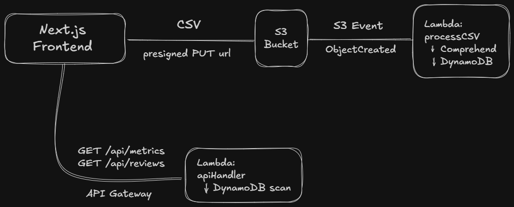

# Risk Analysis Pipeline — Customer Sentiment & Churn Dashboard

A serverless, AI-powered dashboard for analyzing customer feedback. Upload CSVs of customer reviews, process them through **Amazon Comprehend** for sentiment analysis and key phrase extraction, and visualize churn risk in a sleek dark-mode dashboard.

---

## Project Structure

```
risk-analysis-pipeline/
├── backend/
│   ├── serverless.yml          # AWS Serverless Framework config
│   ├── handlers/
│   │   ├── process_csv.py      # S3-triggered NLP processor
│   │   └── api_handler.py      # API Gateway endpoints
│   ├── requirements.txt
│   └── sample_data.csv
├── frontend/
│   ├── src/
│   │   ├── app/
│   │   │   ├── globals.css     # Dark-mode design system
│   │   │   ├── layout.tsx      # Root layout + SEO
│   │   │   └── page.tsx        # Dashboard page
│   │   ├── components/
│   │   │   ├── MetricCard.tsx
│   │   │   ├── SentimentPieChart.tsx
│   │   │   ├── SentimentBarChart.tsx
│   │   │   ├── ChurnRiskChart.tsx
│   │   │   ├── ReviewTable.tsx
│   │   │   ├── FileUpload.tsx
│   │   │   └── Sidebar.tsx
│   │   └── lib/
│   │       ├── api.ts          # API fetch + mock fallback
│   │       ├── types.ts        # TS interface definitions
│   │       └── mockData.ts     # Development mock data (for testing)
│   └── package.json
└── README.md
```

---

## Architecture



## Pipeline Explained

### Uploads & Processing

- Browser calls `GET /api/upload-url?filename=x.csv` and gets back a presigned PUT URL from S3 that expires after 5 minutes. The S3 key is `uploads/{filename}`. Browser then PUTs the file straight to S3.
- S3 ObjectCreated event fires filtered to the .csv suffix, triggering lambda function `processCSV`.
- Two separate Amazon Comprehend calls are made per data row: detect_key_phrases and detect_sentiment.
- Churn risk is then evaluated based on the `Negative` scores in the sentiment response from Comprehend. >= 0.6 is HIGH, >= 0.3 is MEDIUM and anything else is LOW.
- An entry with relevant fields is written to DynamoDB.

### Storage & Reads

- DynamoDB uses `reviewId` as its partition key.
- It has a Global Secondary Index (GSI) called `SentimentIndex` (partition key `sentiment`, sort key `reviewId`) so that the reviews endpoint can filter by sentiment.
- `getMetrics` does a paginated scan and calculates the counts and averages in Python on each request.
- `getReviews` uses GSI `Query` when a sentiment filter is passed, otherwise it does a `Scan(limit=50)`. Either way, the results get sorted by `negativeScore`.

---

## Prerequisites

| Tool                  | Version  | Install                                                        |
| --------------------- | -------- | -------------------------------------------------------------- |
| **Node.js**           | ≥ 18     | [nodejs.org](https://nodejs.org)                               |
| **Python**            | ≥ 3.11   | [python.org](https://python.org)                               |
| **AWS CLI**           | v2       | [AWS CLI Install](https://docs.aws.amazon.com/cli/latest/userguide/getting-started-install.html) |
| **Serverless Framework** | v3    | `npm install -g serverless`                                    |

---

## Quick Start — Frontend (Local Dev)

The frontend ships with **mock data** so you can preview the full dashboard without deploying to AWS.

```bash
# 1. Install dependencies
cd frontend
npm install

# 2. Start dev server
npm run dev

# 3. Open http://localhost:3000
```

---

## Deploy — Backend (AWS)

### 1. Configure AWS credentials

```bash
aws configure
# Enter your Access Key ID, Secret, region (us-east-1), and output format
```

### 2. Deploy the serverless stack

```bash
cd backend
npm install -g serverless   # if not already installed
sls deploy --stage dev
```

This provisions:
- **S3 bucket** — `insight-forge-uploads-dev`
- **DynamoDB table** — `SentimentResults-dev` (with SentimentIndex GSI)
- **3 Lambda functions** — `processCSV`, `getMetrics`, `getReviews`, `getUploadUrl`
- **API Gateway** — HTTP API with CORS enabled

After deployment, note the **API URL** from the output:

```
endpoints:
  GET - https://xxxxxxxxxx.execute-api.us-east-1.amazonaws.com/api/metrics
  GET - https://xxxxxxxxxx.execute-api.us-east-1.amazonaws.com/api/reviews
  GET - https://xxxxxxxxxx.execute-api.us-east-1.amazonaws.com/api/upload-url
```

### 3. Connect the frontend to your API

```bash
# In the frontend directory, create .env.local
echo "NEXT_PUBLIC_API_URL=https://xxxxxxxxxx.execute-api.us-east-1.amazonaws.com" > frontend/.env.local
```

Restart the Next.js dev server. The dashboard will now fetch live data from your API.

---

## Testing the Pipeline

### Upload the sample CSV

```bash
# Using the AWS CLI
aws s3 cp backend/sample_data.csv s3://insight-forge-uploads-dev/uploads/sample_data.csv

# Or use the "Upload CSV" panel in the dashboard UI
```

The S3 upload triggers the `processCSV` Lambda, which:
1. Parses each row of the CSV
2. Calls `comprehend:DetectSentiment` and `comprehend:DetectKeyPhrases`
3. Computes churn risk (HIGH if negative score ≥ 0.6)
4. Writes enriched records to DynamoDB

Refresh the dashboard to see results.

---

## CSV Format

The processor expects CSV files with these columns:

| Column          | Required | Description                        |
| --------------- | -------- | ---------------------------------- |
| `review_id`     | Optional | Unique ID (auto-generated if missing) |
| `customer_name` | Optional | Customer name (defaults to "Unknown") |
| `review_text`   | **Yes**  | The feedback text to analyze       |
| `date`          | Optional | Date string (defaults to now)      |

Alternative column names accepted: `text`, `feedback`, `name`, `id`.

---

## Environment Variables

| Variable              | Where         | Description                           |
| --------------------- | ------------- | ------------------------------------- |
| `NEXT_PUBLIC_API_URL`  | `frontend/.env.local` | API Gateway base URL           |
| `DYNAMODB_TABLE`       | Lambda env    | Set automatically by serverless.yml   |
| `S3_BUCKET`            | Lambda env    | Set automatically by serverless.yml   |

---

## License

MIT
